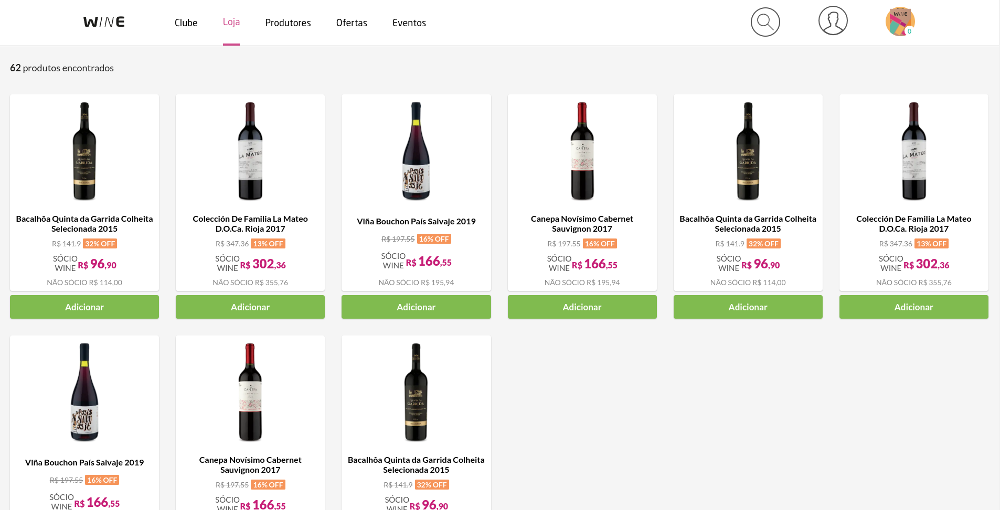
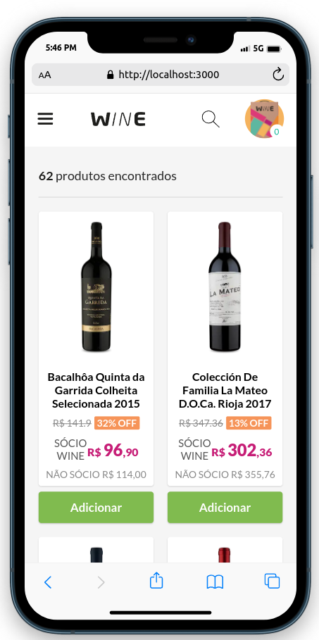

<div align='center'>

# [Wine Shop](https://wine-shop-dcmatheus.vercel.app/)

</div>

<div style="display:flex">
  
  
</div>


Desenvolvido para o desafio técnico Front End da empresa [Wine](https://www.wine.com.br/).

---

## Iniciando a aplicação

- #### Clone o repositório:
    ```bash
    git clone git@github.com:dcmatheus/wine-shop.git
    ```
- #### Entre na pasta do projeto;

- #### Instale as dependências:
    ```js
    npm install
    // ou
    yarn install
    ```

- #### Inicie a aplicação:
    ```js
    npm run dev
    // ou
    yarn dev
    ```

>*A aplicação ficara disponível em http://localhost:3000*

---

## Tecnologias utilizadas

- #### TypeScript;

- #### Next JS;

- #### Tailwind/TailwindStyledComponents: Framework utilizado na estilização dos componentes;

- #### Eslint: Ferramenta que mantém o código seguindo os principais padrões da comunidade;

- #### Husky/CommitLint/Commitzen: Manter os commits padronizados;

- #### Cypress: Bibliotecas de testes;
---

## Estrutura de pastas
Os componentes foram separados baseados no [Atomic Design](https://dcmatheus.notion.site/Atomic-design-f0f6c647b56e44d49efef708bcbac6a6).
```js
src
├── components
│   ├── atoms
│   ├── molecules
│   ├── organisms
│   └── templates
│
├── context // Context da aplicação(contextApi)
│
├── hooks // Hooks react personalizados
│
├── images // Imagens utilizadas na aplicação
│
├── styles // Estilização dos componentes
│
├── types // Arquivos de tipagem
│
└── utils // Arquivos úteis a aplicação que não entram em nenhuma das outras pastas
```

## Deploy

O deploy foi feito utilizando a Vercel.

Link do Deploy: https://wine-shop-dcmatheus.vercel.app/

Deploy com o preview de futuras funcionalidades: https://wine-shop-dcmatheus-preview.vercel.app/
